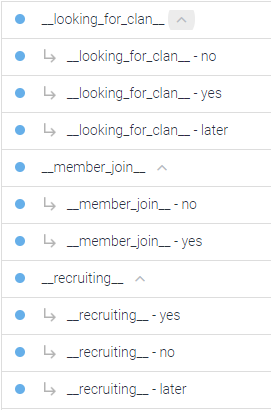
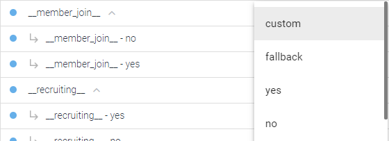
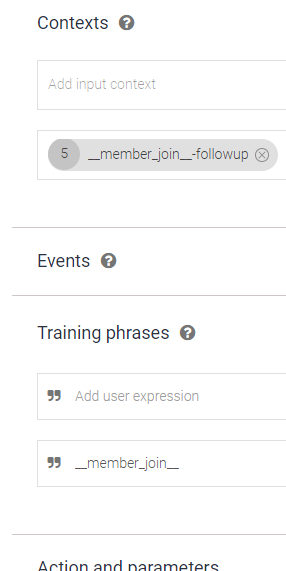
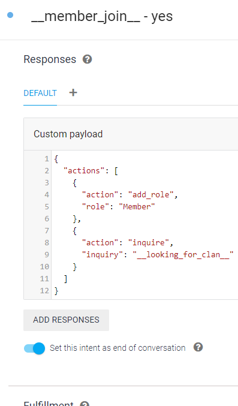
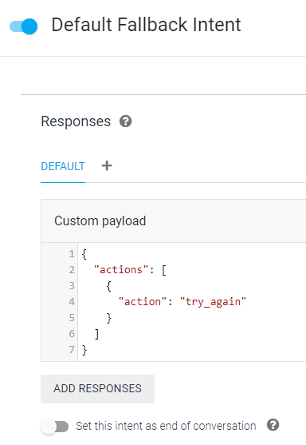

# Dialogflow

The [Dialogflow Repo](https://github.com/googleapis/dialogflow-python-client-v2#before-you-begin) has information on getting service credentials.

```json
{
    "server_if_unknown": "SERVER_ID",
    "project_id": "DIALOGFLOW_PROJECT_ID",
    "service_credentials": "servicecredentials-012345-67890abcdef0.json",
    "try_again_message": "I did not understand you, try answering again.",
    "welcome_message": "Thank you for answering the questions. Please enjoy your stay. If you need any additional assitance please contact one of the mods.",
    "on_member_join": {
        "actions": [
            {
                "action": "inquire",
                "inquiry": "__member_join__"
            }
        ]
    },
    "on_message": [],
    "SERVER_ID": {
        "log_channel": "CHANNEL_ID"
    }
}
```

The `"on_message"` array is words that can be used in a DM to start a Dialogflow conversation. In the example action `inquire` the inquiry `__member_join__` is one of the training phrases in Dialogflow. Dialogflow reponds with a custom payload.  This example has all the currently available options.
```json
{
  "actions": [
    {
      "action": "kick",
      "message": "We are sorry but to access the server you will need to follow the rules. You can rejoin the server in the event you change your mind.\nhttps://discord.gg/__INVITE_CODE__"
    },
    {
      "action": "add_role",
      "role": "Member"
    },
    {
      "action": "inquire",
      "inquiry": "__looking_for_clan__"
    },
    {
      "action": "message",
      "message": "Some info about that thing you answered."
    },
    {
      "action": "question",
      "message": "Welcome to my server.\nDo you agree to follow the rules listed in <#__CHANNEL_ID__>?"
    },
    {
      "action": "finished"
    }
  ]
}
```

Here are some exmaple screenshots of the setup on the Dialogflow back end.

Main overview of conversations. It is best to keep them each separate so that the status part of the cog will properly return the user to their last question in the even the bot restarts or their answering attempts are reached.



There are some premade options for responses:



For the triggers/inquiries it is best to use one training phrase that matches what the bot sends to initiate a conversation.



The reponses should be a custom payload and contain a actions array of actions to perform. Don't forget to mark the end of the conversation.



Make sure the default fallback intent has an action in it. There is a try_again setting but you can easily change that action to a message and put the try again message directly on dialogflow.


